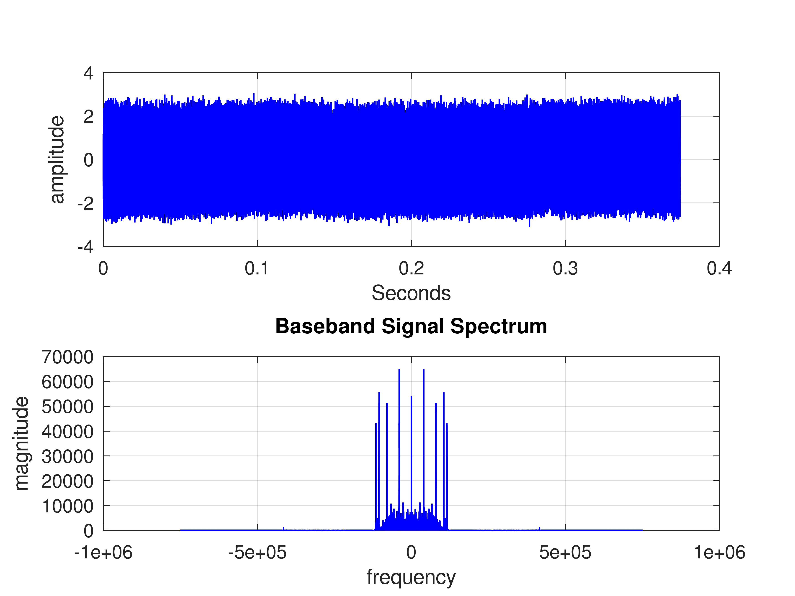
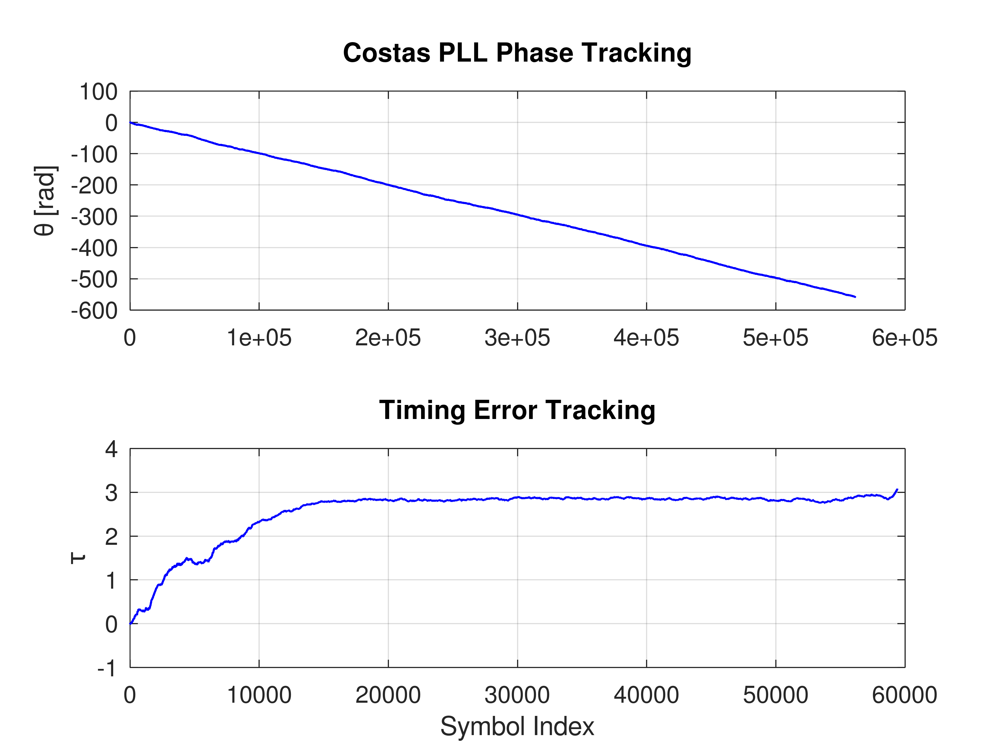
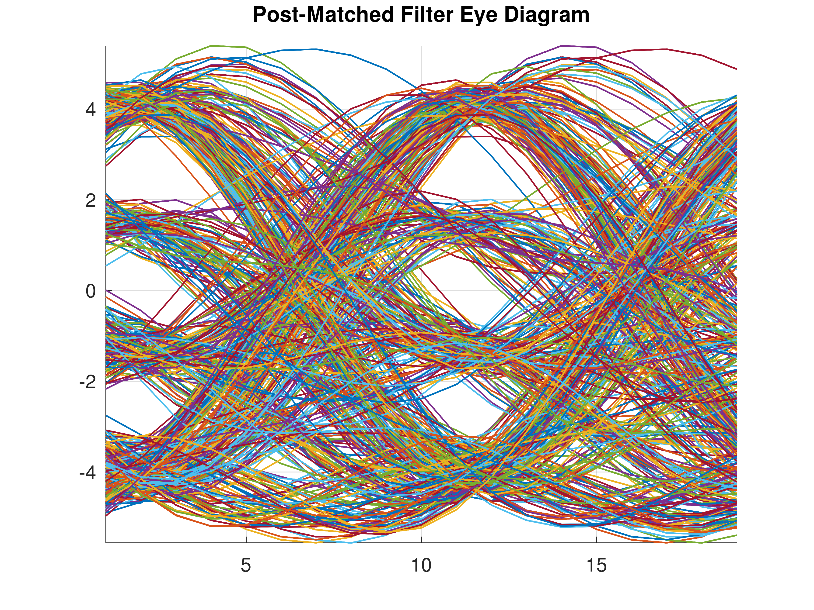
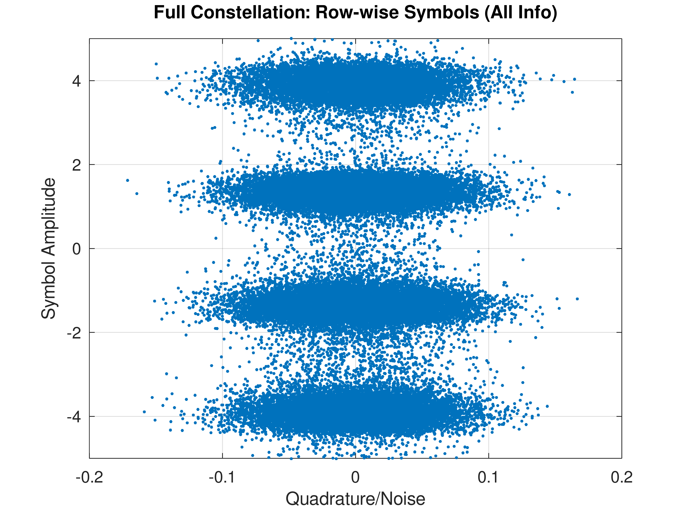

Digital Communication Receiver: Mystery Signal Recovery
# 📡 Overview

This project implements a professional-grade Software Defined Radio (SDR) Receiver in MATLAB.
It is designed to recover hidden text messages from "mystery" signals (A, B, and C) modulated
using M-ary PAM. The receiver handles real-world signal impairments, including frequency offsets,
phase noise, inter-symbol interference (ISI), and timing jitter.

## Key Technical Highlights:

-    **Carrier Phase Recovery:** High-performance Costas Loop for phase-locked loop (PLL) tracking.

-    **Symbol Timing Sync:** Mueller-Muller-inspired timing error detector using sinc interpolation.

-    **Adaptive Filtering:** SRRC matched filtering and notch-filter interference suppression.

-    **Frame Synchronization:** Preamble-based correlation for header detection and payload extraction.

## 🛠 The Receiver Architecture

The receiver follows a standard digital communication pipeline:

### 1. Signal Pre-Processing & Notch Filtering

For complex environments (like Mystery File C), the receiver employs high-Q notch filters.

- **Objective: Suppress** specific narrowband interference (at 90kHz and 100kHz) that could disrupt the PLL or timing recovery.

- **Implementation:** Recursive IIR filters with poles placed close to the unit circle for sharp frequency rejection.

### 2. Carrier Recovery (Costas Loop)

Since the local oscillator is rarely perfectly synchronized with the transmitter, a Costas PLL is used.

- **The Math:** It calculates a phase error by multiplying the In-phase (I) and Quadrature (Q) components of the baseband signal.

- **Loop Filter:** A Low-Pass Filter (LPF) smooths the error signal, which updates the instantaneous phase θ to track the carrier.

### 3. Matched Filtering (SRRC)

To maximize the Signal-to-Noise Ratio (SNR) and minimize ISI, the receiver applies a Root-Raised Cosine (RRC) filter.

- **Pulse Shaping:** The filter is matched to the transmitter's pulse shape.

- **Normalization:** The filter energy is normalized to ensure the symbol amplitudes remain within the expected range for quantization.

### 4. Symbol Timing Recovery

The sampling instances in the ADC are rarely aligned with the centers of the received symbols. The receiver uses a closed-loop timing recovery system:

- **Interpolation:** Uses Sinc Interpolation to calculate signal values between actual samples.

- **Error Detection:** A derivative-based timing error detector adjusts the fractional delay τ.

- **Convergence:** The loop iteratively shifts the sampling point until it lands on the "eye-opening" of the signal.

### 5. Frame Synchronization & Decoding

Once the symbol stream is stabilized, the receiver looks for a known sequence (Preamble).

- **Cross-Correlation:** The receiver slides a local copy of the preamble symbols across the received stream.

- **Header Detection:** A peak in the correlation value indicates the start of a new frame.

- **PAM Decoding:** Soft symbols are sliced into hard levels ([-3, -1, 1, 3]) and mapped back to ASCII characters.

## 📊 Visual Analysis Dashboard

The script generates a comprehensive suite of plots for performance verification:

1. Spectral Analysis: Visualizing the signal in the frequency domain before and after downconversion.

2. Synchronization Performance: Tracking the convergence of the PLL (θ) and the Timing Recovery (τ).



3. Eye Diagram: A high-resolution visualization of the ISI levels. A "clear eye" indicates successful timing and filtering.

4. Constellation Diagram: Displays the recovered symbol points. In a perfect recovery, these should cluster tightly around the PAM levels.



## 🚀 How to Use

1. Clone the Repo:
```Bash
    git clone https://github.com/billchriss717/Software-Defined-Radio-Receiver-.git

    cd Software-Defined_Radio_Receiver
```

2. Setup Folders: Ensure your .mat files are in ./mystery_files/ and an empty directory ./Pictures/ exists for exports.

3. Run in MATLAB:

```text
Open SDR-receiver.m.

Press Run.

Select signal 1, 2, or 3 when prompted in the Command Window.
```

## 👨‍💻 Author

Tadouanla Guetchuin Billy

- **Other Specialization:** Embedded Systems & FPGA Engineering

- **Portfolio:** billchriss717.github.io

*This project was developed as part of the Communication and Information Engineering curriculum at Hochschule Rhein-Waal.*
